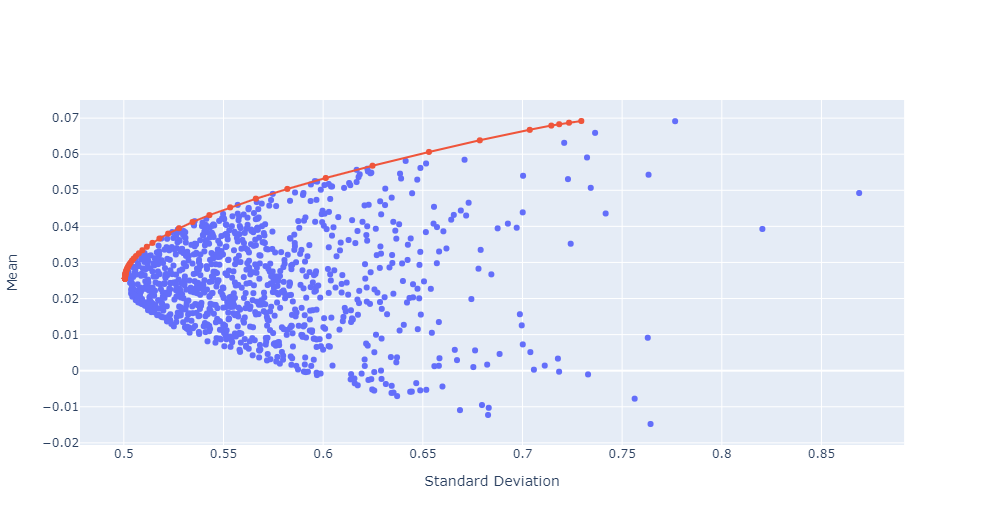

# Portfolio-Optimization-Using-Markowitz-Model

Implemented the Porfolio optimization using Markowitz Model on VOO(NYSE) and BLV(NYSE) initally in Google Sheets and later extending the concept for several assets in Python.

<strong> Google Sheets implementation of the above model for two assets can be found here: [Click Here](https://docs.google.com/spreadsheets/d/1OOhd8j8lQDRxH6Us0X3QrsFkhPGmuOpaQbiEkY7ZrFg/edit?usp=sharing)
  
Python implementation of the above model for several assets can be found here: [Click Here](./Portfolio-Optimization.ipynb)</strong>

The image below shows the Mean Return(Reward) vs Standard Deviation(Risk) plot with Efficient Frontier:

